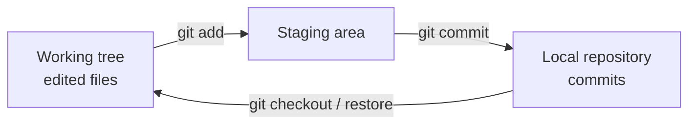
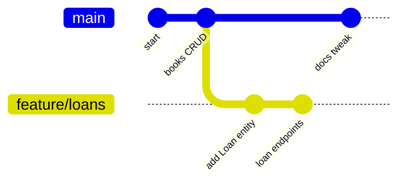
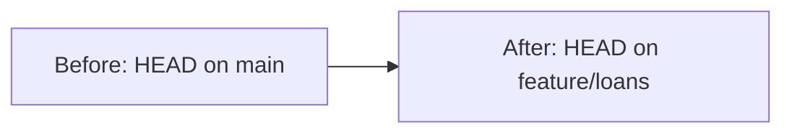
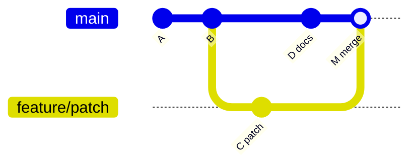
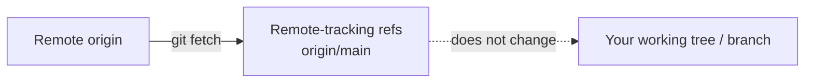
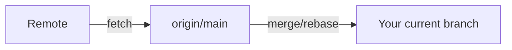
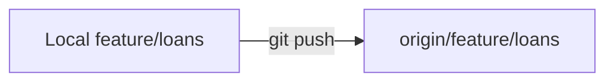
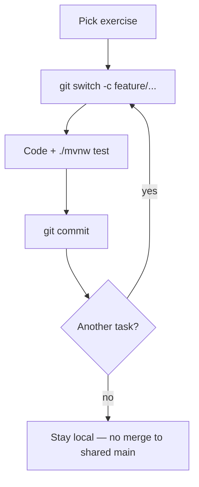

# Git basics for this Library System

← Back to [README](../README.md)

Short, practical Git notes for local learning. Merging into shared `main` is **not** part of your assignment flow — work on feature branches locally.

---

## Three areas: working tree, staging, repository

Git keeps your changes in three places:

1. **Working tree** — files on disk as you edit them
2. **Staging area (index)** — what will go into the next commit (`git add`)
3. **Repository** — committed history (`git commit`)



**Example**

```bash
# edit a file, then:
git status
git add src/main/java/com/polakams/demoservice/book/BookService.java
git commit -m "Add author filter to book listing"
```

---

## Branches — `git branch`

A branch is a movable pointer to a commit. Listing and creating branches:

```bash
git branch                 # list local branches
git branch feature/loans   # create a branch (does not switch)
```



---

## Switching — `git switch` / `git checkout`

Move `HEAD` to another branch (or commit):

```bash
git switch feature/loans
# older equivalent:
git checkout feature/loans

# create and switch in one step:
git switch -c feature/filter-books
```



---

## Merging — `git merge`

Combine another branch’s history into the current branch.

**Fast-forward** — when the current branch has no new commits, Git just moves the pointer forward.

**Merge commit** — when both branches have diverged, Git creates a merge commit joining them.



```bash
git switch main
git merge feature/patch
```

For this Library System project, prefer keeping work on your feature branch. You do **not** need to merge into shared `main` for the exercises.

---

## Fetch — `git fetch`

Download new commits and update remote-tracking branches (`origin/main`, etc.) **without** changing your working tree or current branch.

```bash
git fetch origin
git log HEAD..origin/main --oneline   # see what you don't have yet
```



---

## Pull — `git pull`

`git pull` ≈ `git fetch` + integrate into your current branch (merge or rebase, depending on config).

```bash
git pull origin main
```



Use pull when you intentionally want remote updates in your current branch. For local-only exercises, fetch/pull may be optional.

---

## Push — `git push`

Publish your local commits to a remote branch.

```bash
git push -u origin feature/loans
```



**For this project:** pushing and merging to shared `main` is **not** required. Keep learning commits on your machine (and on a personal remote branch only if your mentor asks).

---

## Recommended local workflow

```bash
# 1. Start from main (local)
git switch main

# 2. Create a branch for one exercise
git switch -c feature/filter-books

# 3. Implement, test, commit
./mvnw test
git add -A
git commit -m "Filter books by author and title"

# 4. Keep iterating on the same branch or start a new one per task
git switch -c feature/authors
```

Diagram of the learning loop:



Return to the [README](../README.md) for run instructions and API URLs, or open [exercises.md](exercises.md) for the task list.
